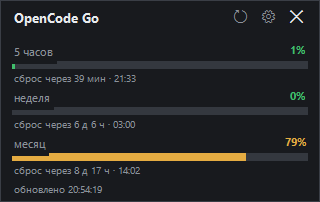

# OpenCode Go Limits

A tiny Windows desktop widget that shows your OpenCode Go usage limits — 5-hour, weekly and monthly — without opening a browser.



## Features

- Three live progress bars: 5-hour, weekly and monthly windows with reset countdowns
- Frameless always-on-top window; drag it anywhere, the position is remembered
- Refreshes every 5 minutes (F5 refreshes manually)
- Color coding: green below 60%, yellow 60–85%, red 85% and above
- Optional Windows toast notification when the 5-hour window crosses a threshold (default 85%)
- Optional autostart with Windows
- No dependencies: a single exe, runs on any Windows 10/11 with built-in PowerShell 5.1

## Requirements

- Windows 10 or 11
- An [OpenCode Go](https://opencode.ai/go) subscription
- `opencode` installed and logged in (`opencode auth login`), so that `%USERPROFILE%\.local\share\opencode\auth.json` contains an `opencode-go` API key

## Download and run

1. Download `OpenCode Limits.exe` from the [latest release](releases/latest)
2. Run it. If SmartScreen shows a warning, choose "More info" → "Run anyway" (the exe is not code-signed)
3. The widget appears in the bottom-right corner of your screen

Close it with ✕, Esc or Alt+F4 — the app exits completely. Run the exe again to open it. If it is already running, launching it again simply brings the window to the front.

## How it works

`OpenCode Limits.exe` is a small launcher with the PowerShell script embedded. On start it extracts the script to `%LOCALAPPDATA%\OpenCodeLimits\app` and runs it hidden. The script reads your API key from `auth.json` and calls `https://opencode.ai/zen/go/v1/usage` every 5 minutes. The key is sent only to `opencode.ai`; the app stores nothing except its own settings in `%APPDATA%\opencode-limits-widget`.

## Settings

Right-click the widget → **Settings...**: refresh interval, notifications on/off, notification threshold, autostart, always-on-top. The same options are available in the right-click menu.

## Build from source

```powershell
powershell -ExecutionPolicy Bypass -File build.ps1
```

Requires Windows PowerShell 5.1 and the .NET Framework compiler (`csc.exe`, ships with Windows). The result is a single `OpenCode Limits.exe`.

Files:

| File | Purpose |
| --- | --- |
| `launcher.cs` | C# launcher: extracts the embedded script and runs it hidden |
| `limits-widget.ps1` | The widget itself (WinForms UI, API calls, settings) |
| `widget.ico` | Application icon |
| `build.ps1` | Builds the single-file exe with `csc.exe` |

## По-русски

Виджет для Windows, который показывает лимиты OpenCode Go (5 часов / неделя / месяц) без открытия браузера. Нужна подписка OpenCode Go и установленный `opencode` (после `opencode auth login`). Скачайте `OpenCode Limits.exe` из релизов и запустите. Настройки — правой кнопкой мыши по виджету. Закрытие (✕ / Esc) завершает приложение полностью.

## License

[MIT](LICENSE)
